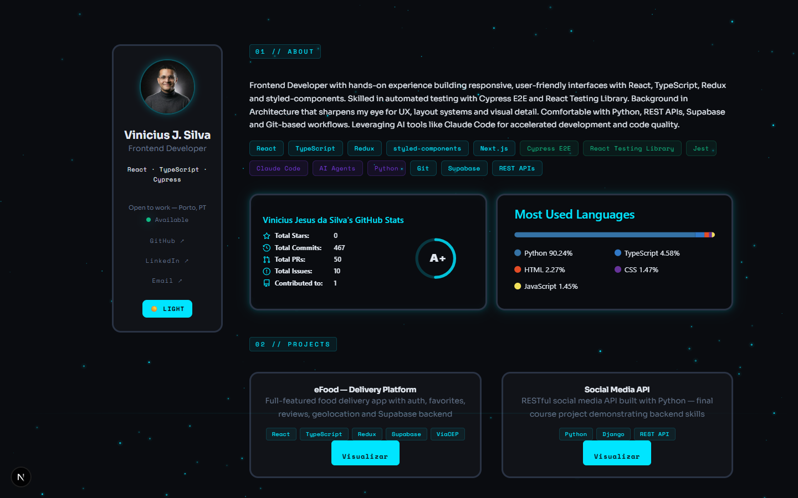

<div align="center">

# Vinicius J. Silva — Developer Portfolio

**Frontend Developer · Porto, Portugal**

[](https://nextjs.org/)
[](https://reactjs.org/)
[](https://www.typescriptlang.org/)
[](https://styled-components.com/)
[](https://portfolio-ebon-nine-95.vercel.app)

### [→ portfolio-ebon-nine-95.vercel.app](https://portfolio-ebon-nine-95.vercel.app)



</div>

---

## Overview

Personal portfolio built with **Next.js 15 App Router** and **TypeScript 5**, showcasing projects, technical stack, and professional background. Designed with a cyberpunk aesthetic and precision focus on UI/UX — a nod to my background in Architecture.

Key engineering decisions made consciously:

- Server Components by default; `'use client'` only where interactivity or browser APIs are required
- styled-components fully integrated with SSR via `useServerInsertedHTML` — zero flash of unstyled content
- Fonts loaded through `next/font/google` with `display: swap` — zero layout shift
- Animated `<canvas>` Starfield built with `requestAnimationFrame`, density-responsive, and correctly cleaned up on unmount

---

## Tech Stack

| Layer | Technology |
|---|---|
| **Framework** | [Next.js 15](https://nextjs.org/) — App Router, Server Components |
| **Language** | [TypeScript 5](https://www.typescriptlang.org/) — strict mode, `DefaultTheme` augmentation |
| **UI Library** | [React 19](https://react.dev/) |
| **Styling** | [styled-components 6](https://styled-components.com/) — ThemeProvider, CSS-in-JS, SSR registry |
| **Fonts** | `next/font` — Sora + Space Mono, zero CLS |
| **Testing** | React Testing Library, Jest |
| **Linting** | ESLint + typescript-eslint |
| **Deploy** | [Vercel](https://vercel.com/) — automatic on push to `main` |

---

## Features

- **Dark / Light theme** — full token-based color system via `ThemeProvider`, toggled at runtime
- **Code-split sections** — `React.lazy` + `Suspense` on each page section for faster initial load
- **Error Boundary** — class component with styled fallback UI; prevents a single section crash from breaking the whole page
- **Animated Starfield** — `<canvas>` with `requestAnimationFrame`, density scales with viewport, cleanup on unmount
- **Responsive layout** — sidebar collapses gracefully on mobile
- **Data-driven projects** — projects rendered from a typed `ProjetoProps[]` array in `src/data/projects.ts`
- **GitHub stats** — live GitHub Stats and Top Languages cards embedded in the About section
- **AI Tooling section** — showcases Claude Code workflows and custom subagent patterns

---

## Project Structure

```
portfolio/
├── app/                        # Next.js App Router
│   ├── layout.tsx              # Root layout: fonts, metadata, StyledComponentsRegistry
│   ├── page.tsx                # Entry Server Component → renders <PortfolioApp />
│   ├── globals.css             # Minimal CSS reset
│   ├── loading.tsx             # Suspense loading state
│   ├── not-found.tsx           # Custom 404 page
│   └── global-error.tsx        # Global error boundary (Next.js)
└── src/
    ├── components/
    │   ├── PortfolioApp/       # Client root — ThemeProvider, lazy section loading
    │   ├── Avatar/             # Profile image component
    │   ├── Starfield/          # Canvas animation ('use client')
    │   ├── ErrorBoundary/      # React class-based error boundary
    │   ├── Projeto/            # Project card component
    │   ├── Paragrafo/          # Typography primitive
    │   └── Title/              # Heading primitive
    ├── containers/
    │   ├── Sidebar/            # Name, links, theme toggle
    │   ├── Sobre/              # About section: bio, skill badges, GitHub stats
    │   ├── Projetos/           # Projects grid — driven by data/projects.ts
    │   └── AISkills/           # AI tooling showcase
    ├── data/
    │   └── projects.ts         # Typed project list (ProjetoProps[])
    ├── lib/
    │   └── registry.tsx        # styled-components SSR — useServerInsertedHTML
    ├── themes/
    │   ├── dark.ts             # Dark theme tokens
    │   └── light.ts            # Light theme tokens
    ├── types/
    │   └── styled.d.ts         # DefaultTheme module augmentation
    └── styles.ts               # Global styled components (Container, SectionLabel)
```

---

## Running Locally

**Prerequisites:** Node.js 18+ · npm

```bash
git clone https://github.com/viniciussilva2504/portfolio.git
cd portfolio
npm install
npm run dev        # http://localhost:3000
```

```bash
# Production build
npm run build
npm start

# Lint
npm run lint

# Tests
npm test

# Generate screenshots for README (requires dev server running)
npm run dev        # in one terminal
npm run screenshot # in another — saves to public/screenshots/
```

---

## Author

**Vinicius Jesus da Silva** — Frontend Developer based in Porto, Portugal.  
Architecture background → career transition into tech. Open to work — frontend roles, remote or hybrid.

[](https://www.linkedin.com/in/vjsilva2504/)
[](https://github.com/viniciussilva2504)
[](https://portfolio-ebon-nine-95.vercel.app)
