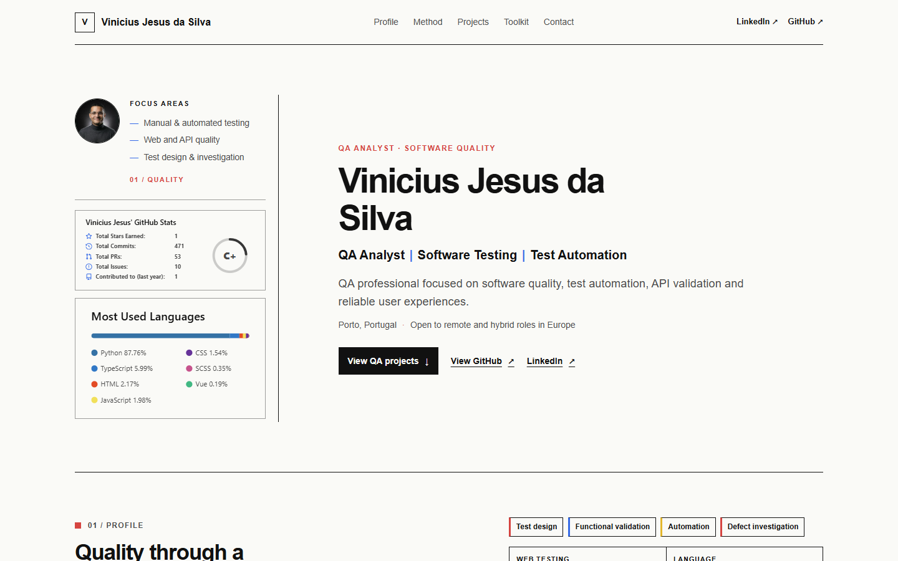

<div align="center">

# Vinicius Jesus da Silva — QA Analyst Portfolio

**QA Analyst · Software Testing · Test Automation · Porto, Portugal**

[](https://nextjs.org/)
[](https://reactjs.org/)
[](https://www.typescriptlang.org/)
[](https://styled-components.com/)
[](https://portfolio-ebon-nine-95.vercel.app)

### [→ portfolio-ebon-nine-95.vercel.app](https://portfolio-ebon-nine-95.vercel.app)



</div>

---

## Index

- [Status](#status)
- [Overview](#overview)
- [Tech Stack](#tech-stack)
- [Features](#features)
- [Project Structure](#project-structure)
- [Running Locally](#running-locally)
- [Author](#author)
- [License](#license)

---

## Status

 

Project live and actively maintained. Open to feedback and contributions.

---

## Overview

Personal portfolio built with **Next.js App Router**, **TypeScript** and **styled-components**, presenting testing work, quality process, engineering projects and technical toolkit. The editorial visual system uses structured grids, rules and restrained accents to foreground evidence and readability.

Key engineering decisions made consciously:

- App Router with the existing client-side styled-components integration
- styled-components fully integrated with SSR via `useServerInsertedHTML` — zero flash of unstyled content
- A local system font stack avoids runtime font downloads
- Fluid, content-driven layouts with reduced-motion support and visible keyboard focus

---

## Tech Stack

| Layer | Technology |
|---|---|
| **Framework** | [Next.js 15](https://nextjs.org/) — App Router |
| **Language** | [TypeScript 5](https://www.typescriptlang.org/) |
| **UI Library** | [React 19](https://react.dev/) |
| **Styling** | [styled-components 6](https://styled-components.com/) — CSS-in-JS, SSR registry |
| **Fonts** | Single system sans-serif stack |
| **Linting** | ESLint + typescript-eslint |
| **Deploy** | [Vercel](https://vercel.com/) — automatic on push to `main` |

---

## Features

- **QA-first information architecture** — testing workflow, QA projects and tool matrix
- **Responsive editorial layout** — content-driven sections and fluid project grids
- **Error Boundary** — styled fallback for page content errors
- **Evidence-oriented project details** — objective, testing approach, tools and available repository links
- **Data-driven projects** — projects rendered from typed data in `src/data/projects.ts`
- **Responsive QA utility** — `npm run qa:responsive` checks eight viewport widths and captures reference screenshots

---

## Project Structure

```
portfolio/
├── app/                        # Next.js App Router
│   ├── layout.tsx              # Root layout: metadata, StyledComponentsRegistry
│   ├── page.tsx                # Entry Server Component → renders <PortfolioApp />
│   ├── globals.css             # Minimal CSS reset
│   ├── loading.tsx             # Suspense loading state
│   ├── not-found.tsx           # Custom 404 page
│   └── global-error.tsx        # Global error boundary (Next.js)
└── src/
    ├── components/
    │   ├── ErrorBoundary/      # Page-content fallback
    │   ├── Hero/               # QA-first positioning and actions
    │   ├── PortfolioApp/       # Client root and page shell
    │   └── Projeto/            # Evidence-led project card
    ├── containers/
    │   ├── Sidebar/            # Responsive header and navigation
    │   ├── Sobre/              # QA-first profile and focus areas
    │   ├── Projetos/           # Evidence-led project grid
    │   ├── AISkills/           # Testing methodology
    │   └── TechStack/          # Testing and engineering tool matrix
    ├── data/
    │   └── projects.ts         # Typed project list (ProjetoProps[])
    ├── lib/
    │   └── registry.tsx        # styled-components SSR — useServerInsertedHTML
    ├── types/                  # styled-components type augmentation
    └── styles.ts               # Global design tokens and layout primitives
```

---

## Running Locally

**Prerequisites:** Node.js 18+ · npm

```bash
git clone https://github.com/viniciussilva2504/portfolio.git
cd portfolio
npm install
npm run dev        # http://localhost:3000
```

```bash
# Production build
npm run build
npm start

# Lint
npm run lint

# Generate README screenshots (requires dev server running)
npm run dev        # in one terminal
npm run screenshot # in another — saves to public/screenshots/

# Responsive layout audit at 8 viewport widths
npm run qa:responsive
```

---

## Author

**Vinicius Jesus da Silva** — QA Analyst based in Porto, Portugal.
Architecture background and a focus on QA Engineering. Open to QA roles in Porto, remote or hybrid.

[](https://www.linkedin.com/in/vjsilva2504/)
[](https://github.com/viniciussilva2504)
[](https://portfolio-ebon-nine-95.vercel.app)

---

## License

This project is licensed under the [MIT License](https://opensource.org/licenses/MIT).
